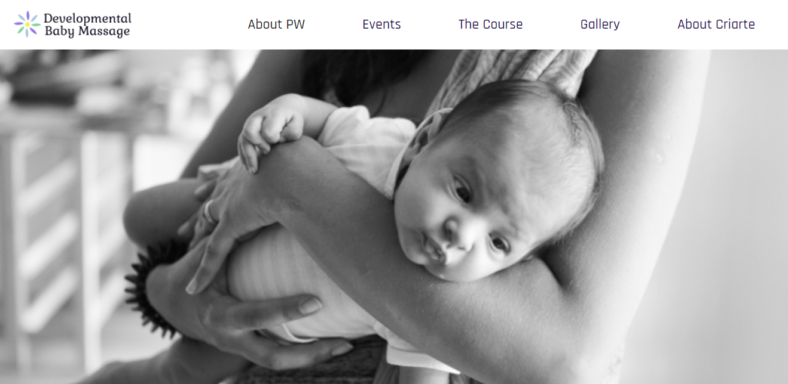
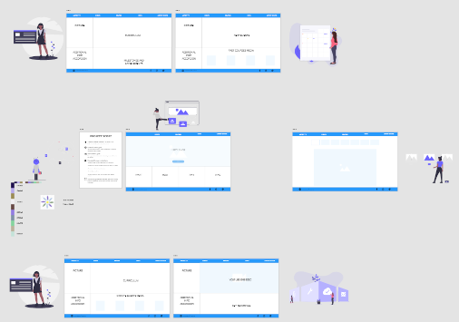
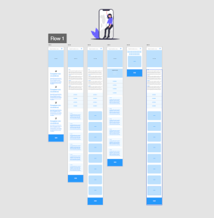

<h1 align="center">Baby Developmental Massage Courses Website</h1>
<h1 align="center"></h1>

## About

Peter Walker is widely respected and well-known as a teacher of Developmental Baby Massage. Peter has over 40 years experience in giving mother and baby massage groups. His certificated teacher training courses for Developmental Baby Massage are enjoyed by health visitors, nursery nurses, midwives, massage and many other therapists working with mothers and babies.
Criarte is a project about Yoga and events of artistic and pedagogical expression with couples, pregnant women, babies, children, their families and professionals who accompany them.
Peter and Criarte joined forces to make Baby Developmental Massage Courses availabe in Portugal, and this website intends to become an infomation hub about this organization, and promote these events to the local target audience (even though everything is in english for evaluation purposes) and the online events to a global audience.

## Table of contents

[User Experience (UI/UX)](#UI/UX)

[Features](#features)

[Technologies](#Technologies)

[Testing](#testing)

[Deployment](#deployment)

[Credits](#credits)

## UI/UX

This website is built for health professionals, moms and baby massage enthusiasts. The vast majority of users will be woman, so the color palette, the pictures and all the content elements were picked in the consideration of making the UI appealing to the feminine side.
The font chosen was Rajdhani because it is coherent and blends well with the design, colors and content.

Thoughout the pages there is always a navigation menu present to make the vast ammount of information on the website accessible with only 1 or 2 clicks, and also a footer to link to additional relevant content and a sign up form that is always there for when the user makes up his/her mind to attend to an event.

All the pages are screen size responsive, so the content always adapts and looks orgazined and easy to read in any kind of device.
The content is displayed in various forms like video, photos, texts, tables and cards so that the user can interact in different and not be bored while visiting the website.

A [desing mockup](https://github.com/jltps/criarte/blob/master/design-files/criarte-website-UI-mockup.xd) was built for both mobile and desktop view using Adobe XD to guide me through the coding process, but some of the initial ideas were changed or adapted as the project evolved:

<h3 align="center">Desktop view</h3>
<h3 align="center"></h3>

<h3 align="center">Mobile view</h3>
<h3 align="center"></h3>

### User Stories

These are the user stories that guided the design process:

- As a professional user, I want to want to know the detailed history and the backgrounds of PW and Criarte, so I can be sure that this is a high quality course and gain confidence in both the teacher and the orgaziner.
- As an enthusiast user, I want to explore more content from other sources (like social media and external websites), to build up my interest about DBM.
- As a mom user, I need to be sure that this will bring great benefits to my baby.
- As a user, I want to know about previous events, so I can see how the events are presented.
- As a user, I want a fast a simple way to sign up for an event when i make my decision.

## Features

 - 6 pages of content
 - 2 navigation elements:
   - Top menu to browse through the pages
   - Footer with links to relevant content
  

### These are the existing Features

- Hover effects on menu items, logo and links - to make the navigation easy and visually appealing.
- Clickable icons - to link to external content or send an email.
- Sign up form on the bottom - always accessible to the user when he decides to go forward (This is a dummy function, it's not sending any data).
- Gallery show media on hover - on desktop view, user only needs to hover the photo thumbnail to show the full size media.
- Youtube embedded video on the Course page
- Accordion effect to show additional content on pages
- Footer stays at the bottom of the page regardeless of content
- Menu shrinks to an expandable hamburger menu on smaller viewports

### These are the features Left to Implement

- Dual language - to make the website available in English and Portuguese.
- Sign up form - to make it send the data to website owner and response to the user.

## Technologies

This website was written in [HTML](https://www.w3.org/TR/html52/) and [CSS](https://www.w3.org/Style/CSS/Overview.en.html).

Some additional technologies were used to achieve the result:
- [Bootstrap 4.5.2](https://getbootstrap.com/) to enhance the design and functionalities 
- [jQuery 3.4.1](https://jquery.com/) for modal form and hamburger icon 
- [Fontawesome 5](https://fontawesome.com/) and [Icons8](https://icons8.com/) for icons 
- [Google Fonts](https://fonts.google.com/) for typography 
- [Youtube](https://www.youtube.com) embedded video 
- [Visual Studio Code](https://code.visualstudio.com/) as the IDE
- [Git](https://git-scm.com/) for version control
- [Github](https://github.com/) as remote repository
- [Adobe XD](https://www.adobe.com/products/xd.html) for design mockups
- [GIMP](https://www.gimp.org/) for photo editing
- [Free Logo Design](https://www.freelogodesign.org/) for the design of the logo

## Testing

This project was tested in Google Chrome, Microsoft Edge and Mozilla Firefox and it's working as expected in all of them. Aditional testing in Safari required.
It was also tested in all screen sizes and no issues in resposiveness have been detected.

These tests were conducted:
- Page links in header navigation in the different pages
- Hover effects on header navigation links in the different pages
- Links in the footer in the different pages
- Hover effects on links in the footer in the different pages
- Gallery photos all displaying on thumbnail hover
- Accordion working in all different pages
- Text cards displaying correctly
- Youtube video playing correctly

Code validation:
- HTML passed the [W3C Markup Validation Service](https://validator.w3.org/#validate_by_uri)
- CSS passed the [W3C CSS Validation Service](https://jigsaw.w3.org/css-validator/)

## Deployment

The website was deployed in Github Pages, directly from the repository files, using the following procedure:
1. Open Github website and select the appropriate repository
2. Click 'Setting' on the menu and scroll down until you find Github Pages 
3. Under the 'Source' click on the dropdown and select 'master branch'. The page will reload and you'll see the link of your published page
4. Click the link to view the published website: https://jltps.github.io/criarte/ 

      
## Credits

### Content and Media

- The text and media content was obtained from the Peter Walker's website and Criarte's social media pages, all linked in the project website.

### Acknowledgements

- I received inspiration for the colour scheme from this website: https://dribbble.com/shots/14172278-Nutrition-Food-Company-Website
- The original code for the hover effects that was adapted to this project belongs to zuDust:  https://codepen.io/jstn/pen/zuDst
- The original code for the Gallery photos that was adapted to this project belongs to mehfuza: https://www.sourcecodester.com/tutorials/other/5705/creating-image-gallery-html-and-css.html
- The code for the Sign Up modal form and accordeon effects was adapted from Bootstrap's Documentation: https://getbootstrap.com/docs/4.5/getting-started/introduction/ 
- My mentor for the valuable guidance

